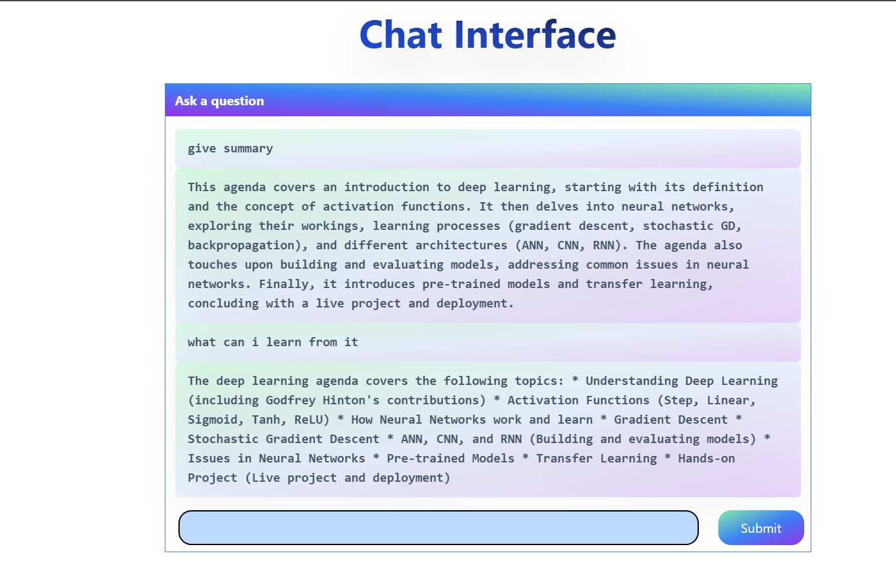
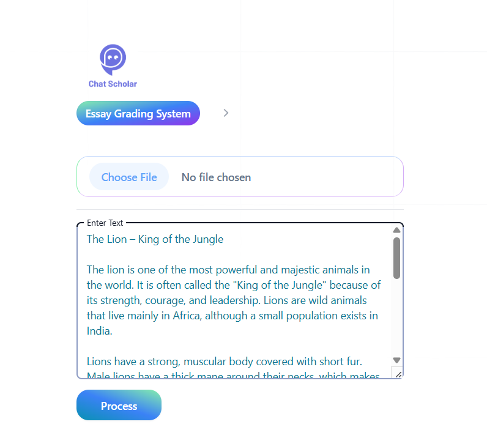

# ChatScholar - AI Learning Assistant

## Overview
AI-powered platform for document analysis and essay grading with conversational interface.

## Objective:
Chat Scholar has two primary objectives.
1.	Academic Research and Understanding: Chat Scholar provides clear and concise answers, summaries, and explanations tailored to the student's specific questions and the content of their documents.
2.	Essay Grading Rubric: Teachers and instructors can create and upload their own custom rubrics to personalize essay evaluation and ensure alignment with specific course requirements.
How it works:
1.	Document Upload and Processing: Users upload PDF documents, and the application extracts the textual content.
2.	Text Embedding and Semantic Search: The extracted text is processed, embeddings are generated, and a semantic search engine (using FAISS) allows for efficient retrieval of relevant information.
3.	Question Answering: Students' questions are processed, compared to the indexed content, and the most relevant information is used to generate a comprehensive answer using the OpenAI LLM.
4.	Essay Grading Rubric:
•	Rubric Selection: Students can choose from pre-defined rubrics (e.g., IELTS, TOEFL) or upload custom rubrics created by their teachers.
•	Essay Evaluation: The rubric tool analyses the student's essay against the selected rubric's criteria.
•	Feedback Generation: Based on the analysis, Chat Scholar provides feedback on the essay's strengths and areas for improvement, highlighting specific criteria met or not met.

Key Inputs: 
For this particular project, we would need the below key inputs:
•	Chat Scholar
o	Upload the document (pdf) for which you want chat bot.
•	Essay Grading Rubric
o	Choose the pre-defined rubric (IELTS/TOEFL) or upload the custom rubric.
o	The rubric tool analyses the student's essay against the selected rubric's criteria.

## Key Features

### 1. Document Chat System
- Upload and chat with PDF documents
- Context-aware question answering
- Deep learning content analysis

### 2. Essay Grading System
- Customizable grading rubrics
- Supports text input or file upload
- Detailed scoring with feedback

## User Interface

#### Home Screen
  
Access both document chat and essay grading systems

#### PDF Processing
  
Upload documents for AI analysis

#### Chat Example
  
Ask questions about uploaded documents

#### Grading Rubric Setup
  
Define evaluation criteria

#### Essay Submission
  
Enter text or upload files

#### Grading Results
  
Receive detailed feedback

## Technical Implementation

### Core Components
- **Backend**: Flask
- **AI Models**: Google Gemini
- **Document Processing**: PyPDF2
- **Vector Storage**: FAISS
- **Embeddings**: HuggingFace

### Processing Flow
1. Document upload → Text extraction
2. Content chunking → Vector conversion
3. Query processing → Contextual response
4. Essay evaluation → Rubric application

## Usage Guide

1. **For Document Analysis**:
   - Upload PDF files
   - Ask questions about content
   - View AI-generated responses

2. **For Essay Grading**:
   - Set grading criteria
   - Submit essay text or file
   - Review scored results

## Product Report:
Chat Scholar represents a significant step towards leveraging AI to create a more engaging and effective learning experience for students, empowering them to excel in their academic pursuits.

